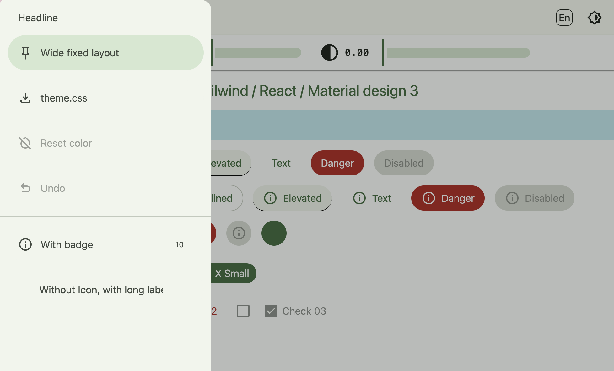
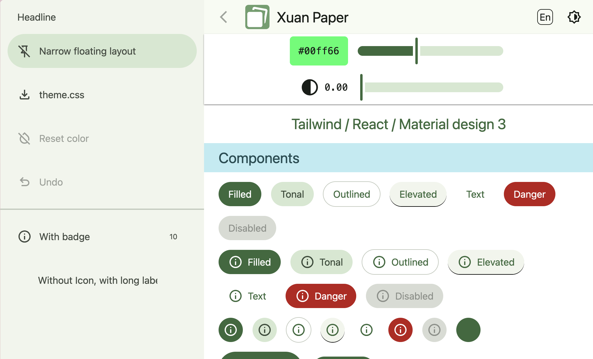

# Xuan paper

Tailwind / React / Material design 3

[Sample](https://xuan-paper.michinobu.jp)

[API](docs/api.md)


<p style="float: left">


</p>




## Note

```
$ npm create @vite-pwa/pwa@latest

✔ Project name: … xuan-paper
✔ Select a framework: › React
✔ Select a variant: › JavaScript
✔ PWA Name: … xuan-paper
✔ PWA Short Name: … xuan-paper
✔ PWA Description: …
✔ Theme color: … #46B482
✔ Select a strategy: › injectManifest
✔ Select a behavior: › Prompt for update
✔ Enable periodic SW updates? … no / yes
✔ Show offline ready prompt? … no / yes
✔ Generate PWA Assets Icons on the fly? … no / yes

$ cd xuan-paper
$ npm i
$ npm i tailwindcss @tailwindcss/vite
$ npm init @eslint/config@latest

✔ What do you want to lint? · javascript
✔ How would you like to use ESLint? · problems
✔ What type of modules does your project use? · esm
✔ Which framework does your project use? · react
✔ Does your project use TypeScript? · No / Yes
✔ Where does your code run? · browser
✔ Would you like to install them now? · No / Yes
✔ Which package manager do you want to use? · npm

$ $ npm i prop-types
$ npm i -D --save-exact prettier
$ node --eval "fs.writeFileSync('.prettierrc','{}\n')"
$ node --eval "fs.writeFileSync('.prettierignore','# Ignore artifacts:\nbuild\ncoverage\n')"

$ npm i react-i18next i18next
```
